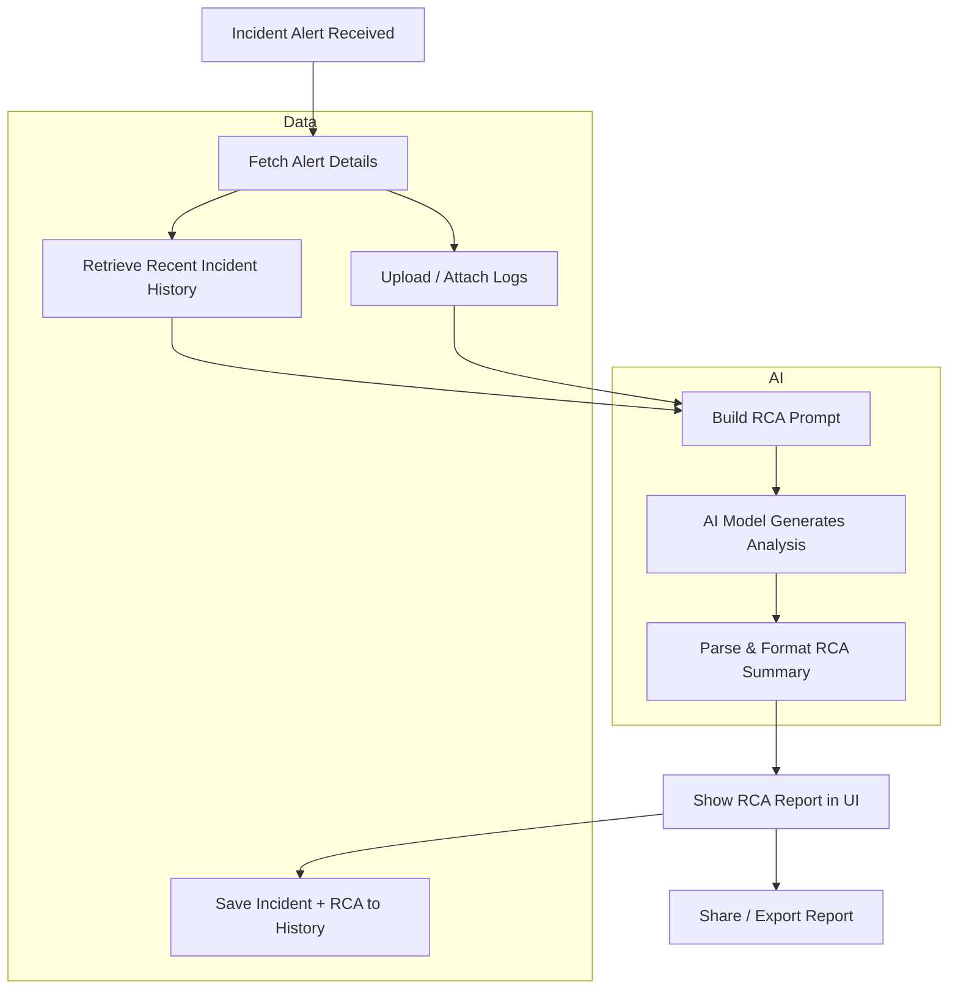

# AI-Powered RCA Generator Flow Diagram

## Flow steps

1. Incident alert arrives from monitoring system (Azure Monitor / other alert source).
2. Alert details are fetched and normalized.
3. Recent incident history is retrieved to compare patterns and root causes.
4. Logs or supporting data are uploaded or attached to the incident.
5. A single prompt is built for the AI model combining alert, history, and logs.
6. The AI model generates a root cause analysis and recommendation summary.
7. The summary is parsed, formatted, and displayed in the UI.
8. The incident and generated RCA are saved back to history for future comparisons.
9. The report can be shared, exported, or used for post-mortem records.
